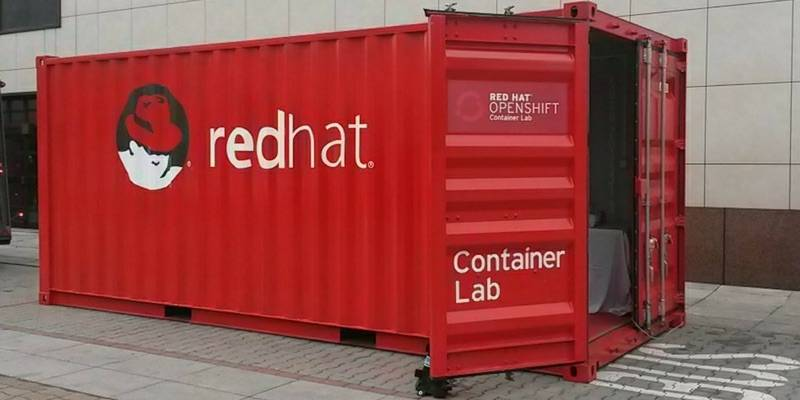

# RedHat TechClub - Containers

## Requirements
* Environemtn with podman installed [Install guide](https://podman.io/getting-started/installation )
* Any text editor. Visual Studio Code will be used during the workshop

## Workshop
We will learn to build and start deno image.
### Basic deno image
1. A basic deno image will be built. [Dockerfile.basic](Dockerfile.basic)

    `podman build -t deno:basic --file Dockerfile.basic .`

2. Built image will be started

    `podman run --rm deno:basic`

### Basic deno webserver image
1. A webserver deno image will be built. [Dockerfile.webserver](Dockerfile.webserver)

    `podman build -t deno:webserver --file Dockerfile.webserver .`

2. Built image will be started

    `podman run --rm deno:webserver`

3. Built image will be started with port mapping

    `podman run --rm -p "8080:8080" deno:webserver`

### Built deno webserver image
1. An image will be built with a compiled version of deno webserver. [Dockerfile](Dockerfile)

    `podman build -t deno .`

2. Built image will be started with port mapping

    `podman run --rm -p "8080:8080" deno`

3. Built image will be started with port mapping and custom environment variable passed

    `podman run --rm -p "8080:1234" -e "PORT=1234" deno`